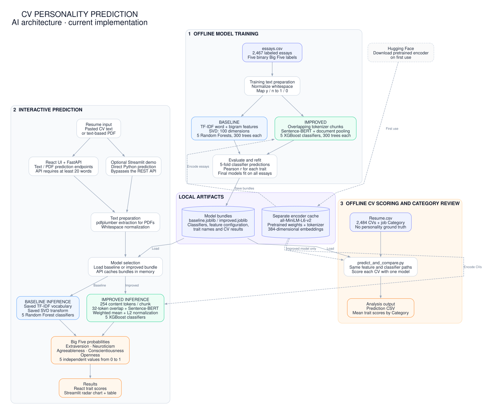
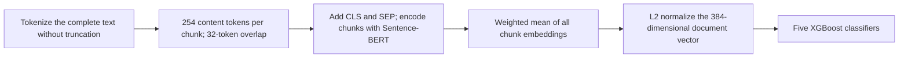

# CV personality prediction: AI architecture

This project predicts five Big Five personality labels from resume text. It
trains five independent binary classifiers on labeled essays, then applies
them to CVs. The two model choices are a TF-IDF/SVD/Random Forest baseline and
a Sentence-BERT/XGBoost model. The pretrained sentence encoder supplies text
features; its weights are frozen while the XGBoost classifiers are trained.



Download the [PNG](ai-architecture.png) or [SVG](ai-architecture.svg) for a
presentation. The [Mermaid source](ai-architecture.mmd) and
[Graphviz source](ai-architecture.dot) are editable. Solid arrows show data
flow; dashed arrows show access to the separately cached pretrained encoder.
The containers group processing stages; they do not represent separate
deployed services.

## Training and model artifacts

`source/common.py` loads `source/essays.csv`, maps the `y`/`n` labels to
`1`/`0`, removes rows missing text or labels, and normalizes whitespace.
The current dataset contains 2,467 usable essays. Each essay has labels for
Extraversion (`cEXT`), Neuroticism (`cNEU`), Agreeableness (`cAGR`),
Conscientiousness (`cCON`), and Openness (`cOPN`).

| Stage | Baseline | Improved |
| --- | --- | --- |
| Training entry point | `source/train_baseline.py` | `source/train_improved.py` |
| Text representation | TF-IDF unigrams and bigrams; maximum 5,000 features; English stop words; `min_df=2` | Frozen `all-MiniLM-L6-v2` Sentence-BERT encoder applied to overlapping tokenizer-token chunks |
| Document features | Truncated SVD, 100 dimensions by default | Weighted mean of chunk embeddings, then L2 normalization; 384 dimensions in the current bundle |
| Prediction heads | Five independent Random Forest classifiers; 300 trees each | Five independent XGBoost classifiers; 300 trees each; depth 4; learning rate 0.05; row/column sampling 0.8 |
| Classifier evaluation | Five-fold stratified out-of-fold probabilities; Pearson correlation with each binary trait label | Same classifier evaluation procedure |
| Saved bundle | `source/models/baseline.joblib` | `source/models/improved.joblib` |
| Saved contents | TF-IDF vectorizer, fitted SVD, classifiers, trait metadata, `cv_results` | Classifiers, encoder name, chunking configuration, trait metadata, `cv_results`, optional `shap_summaries` |

The scripts evaluate each trait classifier, refit it on the full essay dataset,
and save the deployment bundle. Sentence-BERT weights and its tokenizer live
in a separate Hugging Face/Sentence Transformers cache; `improved.joblib`
stores their model name, rather than a copy of the encoder.

SHAP is an optional training step. `TreeExplainer` summarizes the ten most
influential embedding dimensions for each trait using the first 200 training
documents. The current improved bundle has an empty `shap_summaries`
dictionary. The current API and UIs do not serve or display SHAP explanations.

## How a long document becomes one embedding

The training script, API, batch scorer, and Streamlit demo share the improved
model's embedding logic in `source/embedding_utils.py`:



The current saved bundle uses an encoder limit of 256 tokens: 254 content
tokens plus `CLS` and `SEP`. The overlap leaves a stride of 222 tokens. Every
content token is covered, including the document's final suffix. Chunks are
encoded in batches of 32 by default with gradients disabled.

For chunk embedding `e_i`, its weight `w_i` is the number of newly covered
content tokens. The document representation is:

```text
pooled = sum(w_i * e_i) / sum(w_i)
document_vector = pooled / ||pooled||_2     when the norm is nonzero
```

This weighting reduces overlap's contribution to the pooled representation.
The encoder is required to use BERT-style `CLS`/`SEP` tokens. Serving and batch
scoring require the saved strategy
`token_id_chunk_weighted_mean_pool_v1`; legacy improved bundles must be
retrained before those paths accept them.

## Interactive prediction

The default application is `app/frontend` (React/Vite) connected to
`app/backend/main.py` (FastAPI). The user pastes text or uploads a PDF and
chooses `baseline` or `improved`. PDFs are read with `pdfplumber`, then their
extracted text is cleaned. The API rejects prediction text shorter than
20 words.

| Route | Input | Output |
| --- | --- | --- |
| `POST /api/v1/predict` | JSON containing `text` and `model_id` | Five trait probabilities and model/source metadata |
| `POST /api/v1/extract/pdf` | Multipart PDF file | Extracted text, filename, and word count |
| `POST /api/v1/predict/pdf` | Multipart PDF file and `model_id` | Five trait probabilities and model/source metadata |
| `GET /api/v1/models` | None | Model descriptions and artifact-file availability |
| `GET /api/v1/health/ready` | None | API status and whether the two model files exist |

The React PDF flow first extracts text so the user can preview it, then submits
the PDF again to the PDF prediction endpoint. The API loads the selected
`joblib` bundle lazily and caches it in memory. It also lazily initializes and
caches the sentence encoder for improved predictions. Baseline inference
reuses the saved TF-IDF vocabulary and SVD transform; improved inference reuses
the saved chunking configuration and the pretrained encoder.

Each classifier returns `predict_proba(features)[0, 1]`. The result contains
five independent estimates of the positive trait label, each between zero
and one. These scores do not sum to one. React displays the trait scores;
`source/app.py` offers a separate Streamlit demo with a radar chart and score
table. Streamlit runs Python inference directly and bypasses the FastAPI
service; short input produces a warning in that demo.

## Batch scoring and evaluation boundaries

`source/predict_and_compare.py` applies either bundle to the 2,484 usable CVs
in `source/Resume.csv`, writes a prediction CSV, and prints average trait
scores per job `Category`. `Resume.csv` supplies no personality labels.
Category comparisons describe patterns in predictions; they cannot measure
personality prediction accuracy on CVs. Training on essays and predicting
on CVs also introduces a change in the text domain.

The stored `cv_results` are Pearson correlations, rather than accuracy
percentages. The baseline script fits TF-IDF and SVD on the full essay
dataset before classifier cross-validation, so its preprocessing is not
isolated within each training fold. The current procedure is classifier
cross-validation, not nested cross-validation.

PDF extraction currently supports documents containing readable text. There
is no OCR stage for scanned resumes. The application currently uses local
files and process-memory caches; it has no prediction database, vector
database, retrieval pipeline, or generative chat stage. Encoder downloads are
the external model dependency; prediction computation runs locally once its
weights are cached.

## Startup and source map

`start.command` calls `app/launcher.py`. The launcher prepares dependencies,
validates or recovers the baseline model, selects available local ports,
starts React and FastAPI, and checks a real baseline prediction before opening
the browser. `--streamlit` starts the standalone demo instead. Startup does
not retrain the improved model or warm its sentence encoder; the first improved
prediction can include encoder initialization and downloads.

| Responsibility | Source |
| --- | --- |
| Dataset loading, trait definitions, text cleanup | [common.py](../source/common.py) |
| Baseline training | [train_baseline.py](../source/train_baseline.py) |
| Improved training and optional SHAP | [train_improved.py](../source/train_improved.py) |
| Token chunking and document pooling | [embedding_utils.py](../source/embedding_utils.py) |
| HTTP input validation, extraction, model cache, inference | [main.py](../app/backend/main.py) |
| Browser interface and API client | [App.tsx](../app/frontend/src/App.tsx), [api.ts](../app/frontend/src/api.ts) |
| Standalone demo | [app.py](../source/app.py) |
| Offline CV scoring and Category summaries | [predict_and_compare.py](../source/predict_and_compare.py) |
| macOS startup and recovery | [start.command](../start.command), [launcher.py](../app/launcher.py) |

To regenerate the exported overview after editing its Graphviz source, run
these commands from the project root with Graphviz installed:

```bash
dot -Tsvg docs/ai-architecture.dot -o docs/ai-architecture.svg
dot -Tpng -Gdpi=144 docs/ai-architecture.dot -o docs/ai-architecture.png
```

Update the Mermaid source as well when the architecture changes. Dataset
counts and model dimensions above were checked against the current local
datasets and saved bundles.
